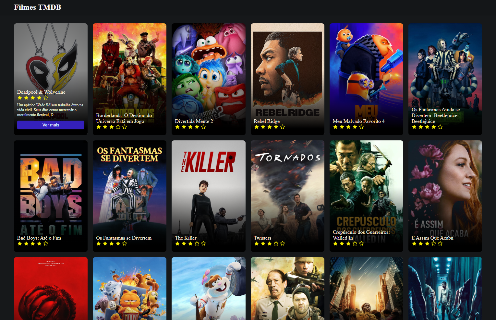

# Filme TMDB
Aplicação interativa em React que exibe uma lista de filmes populares utilizando a API do The Movie Database (TMDB). O projeto é composto por uma interface limpa e moderna, projetada para oferecer uma experiência de usuário envolvente e responsiva.

# Tecnologias Utilizadas:

**React:** Para construção da interface de usuário.

**TypeScript:** Para tipagem estática e robustez no desenvolvimento.

**Axios:** Para realizar requisições HTTP à API.

**SASS:** Para estilização avançada e organização de estilos.

